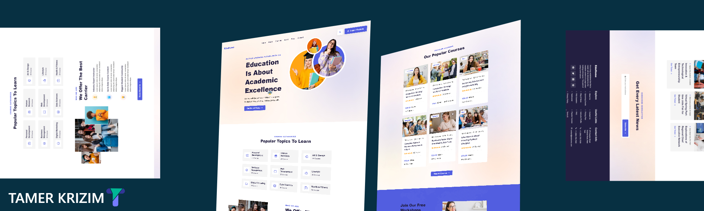

# Project Title

EduHome-Template

## Description

Front end web design for an educational website designed using HTML, CSS and JS

## Getting Started

### Dependencies

* There is no Dependencies

### Executing program

* How to run the program 

The website run in browser with no dependencies.

DEMO: <a href="https://tamer-krizim.github.io/EduHome-Template/">https://tamer-krizim.github.io/EduHome-Template/</a>

## Authors

Contributors names and contact info

ex. Tamer_Krizim  
ex. [@tamerKrizim](https://twitter.com/Tamer26270277)

## Version History

* 0.2
    * Various bug fixes and optimizations
* 0.1
    * Initial Release

## Languages
- HTML5
- CSS3
- JS with ES6
- ionicon open source icons
